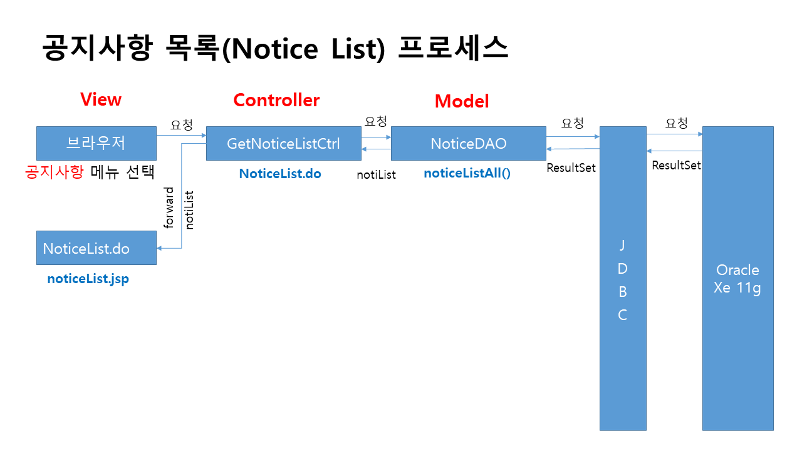

# 프로젝트 개요
"루메나" 라는 전자제품(선풍기) 판매 기업의 쇼핑몰 사이트 제작을 주제로 프론트엔드 부분은 html과 css, javascript로 작성하고, 백엔드 부분은 jsp를 활용하여 기업형 데스크탑 웹 애플리케이션을 작성하였으며, 해당 프로젝트는 회원기능인 회원가입, 로그인, 로그아웃, 회원 정보 확인, 회원 정보 수정, 회원 탈퇴, 회원의 게시판 글 목록, 글 상세보기, 글 등록, 글 수정, 글 삭제 등의 기능을 구현하였음.

# 프로젝트 설계

## 개념적 설계
- 유스케이스

## 논리적 설계
- 정보공학적 ERD

## 물리적 설계
- db ERD

## 클래스 설계
- 클래스 다이어그램

## 시퀸스 설계
- 시퀸스 설명

# 프로젝트 구성

